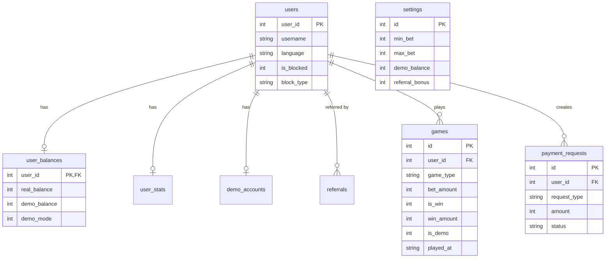
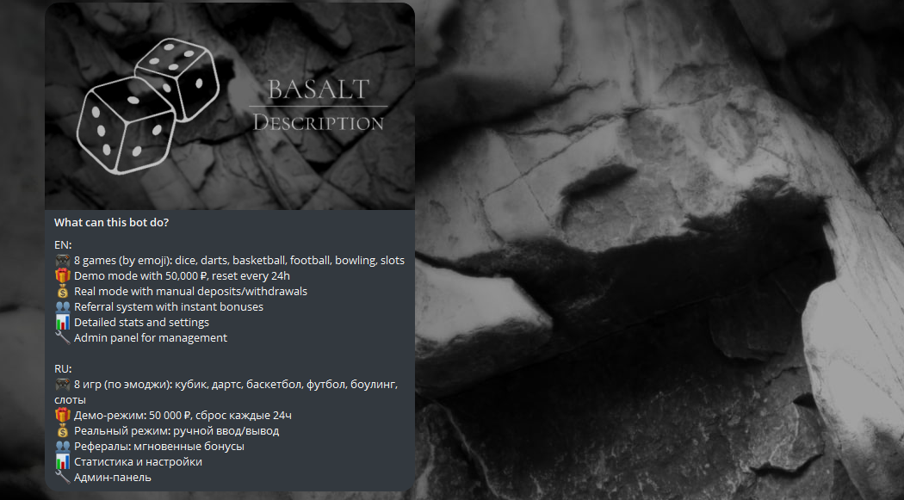
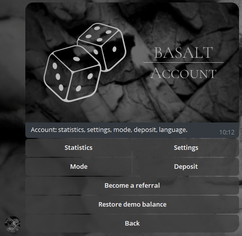
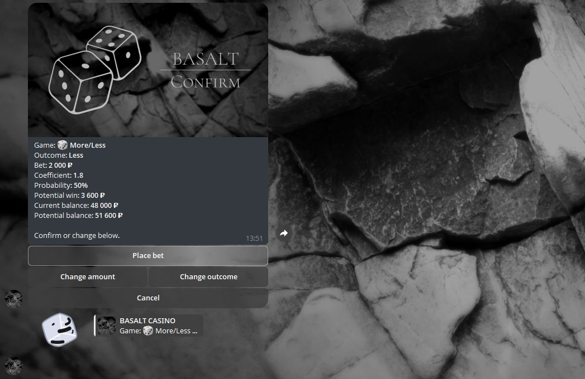

# BASALT Casino

Telegram bot (aiogram 3.x) for a small casino: dice, darts, basketball, football, bowling, slots. Demo and real modes, deposits/withdrawals, referral system, admin panel, WebApp stats.

**Stack:** Python 3.12, aiogram 3, aiosqlite, Pydantic, loguru.

---

## Quick start

```bash
cp .env.example .env
# Edit .env: BOT_TOKEN, ADMIN_IDS

make install
make migrate
make run
```

**Docker:**

```bash
cp .env.example .env
# Edit .env

docker-compose up -d
```

---

## Commands

| Command        | Description                         |
|----------------|-------------------------------------|
| `make run`     | Start the bot                       |
| `make migrate` | Apply DB migrations (create tables) |
| `make backup`  | Run backup and cleanup once         |
| `make clean`   | Remove `__pycache__`, `.pyc`        |
| `make test`    | Run pytest                          |

---

## Architecture

```
┌─────────────────────────────────────────────────────────────┐
│  Telegram (updates)                                         │
└──────────────────────────────┬──────────────────────────────┘
                               │
┌──────────────────────────────▼──────────────────────────────┐
│  Handlers (aiogram routers)                                 │
│  start, info_help, user, games, bet, payments, admin        │
└──────────────────────────────┬──────────────────────────────┘
                               │
┌──────────────────────────────▼──────────────────────────────┐
│  Services (business logic, no Telegram)                     │
│  game, balance, referral, stats, demo                       │
└──────────────────────────────┬──────────────────────────────┘
                               │
┌──────────────────────────────▼──────────────────────────────┐
│  Database (aiosqlite) — queries, models, migrations         │
└─────────────────────────────────────────────────────────────┘
```

- **Handlers** only handle Telegram events and call services.
- **Services** contain game rules, balance, referrals, stats; they use DB queries only.
- **Middlewares:** TechWork → UserBlock → DemoRestore → Logging (order matters).

See [docs/architecture.md](docs/architecture.md) for details.

---

## Database schema (3NF)



Main tables: `users`, `user_balances`, `games`, `payment_requests`, `settings`, `user_stats`, `referrals`, `demo_accounts`. All configurable limits (min_bet, max_bet, coefficients, referral_bonus, demo_balance, tech_works flags) live in `settings` and are editable via admin panel.

---

## Project layout

```
BASALT
├── .env                                    # Environment variables (not in repo)
├── .env.example                            # Template for environment variables
├── .gitignore                              # Git exclusions
├── .pre-commit-config.yaml                 # Linters before commit
├── Makefile                                # Commands: run, migrate, backup, clean, test
├── docker-compose.yml                      # One-command Docker launch
├── Dockerfile                              # Containerization
├── requirements.txt                        # Dependencies
├── README.md                               # Project description
├── CHANGELOG.md                            # Version history
│
├── bot/                                    # Main bot directory
│   ├── __init__.py
│   ├── main.py                             # Entry point, middlewares, polling
│   ├── config.py                           # Pydantic Settings from .env
│   │
│   ├── core/                               # Constants
│   │   ├── __init__.py
│   │   ├── constants.py                    # Paths, backup limits, game types
│   │   ├── exceptions.py                   # Custom exceptions
│   │   ├── types.py                        # Type aliases
│   │   └── games.py                        # GAME_LIST, emoji and image mapping
│   │
│   ├── database/                           # Database layer
│   │   ├── __init__.py
│   │   ├── connection.py                   # aiosqlite, connection pool, migrations
│   │   ├── models.py                       # Pydantic models
│   │   ├── migrations/                     # SQL migrations
│   │   │   ├── 001_initial.sql
│   │   │   └── 002_user_contact.sql
│   │   └── queries/                        # Entity-specific queries
│   │       ├── __init__.py
│   │       ├── users.py                    # get_user, create_user, update_balance
│   │       ├── games.py                    # save_game, get_last_games
│   │       ├── payments.py                 # create_request, approve/reject
│   │       ├── referrals.py                # add_referral, get_referrer
│   │       ├── settings.py                 # get/update settings
│   │       ├── demo_accounts.py            # demo account management
│   │       └── user_stats.py               # user statistics
│   │
│   ├── handlers/                           # aiogram routers
│   │   ├── __init__.py                     # Router assembly
│   │   ├── start.py                        # /start, referral logic
│   │   ├── info_help.py                    # /info, /help
│   │   │
│   │   ├── user/                           # User screens
│   │   │   ├── __init__.py
│   │   │   ├── profile.py                  # Account menu
│   │   │   ├── settings.py                 # Settings, mode, language
│   │   │   ├── stats.py                    # Text statistics
│   │   │   └── referral.py                 # Referral link
│   │   │
│   │   ├── games/                          # Game logic
│   │   │   ├── __init__.py
│   │   │   ├── list_handler.py             # Game list
│   │   │   └── flow.py                     # Outcome → bet → result
│   │   │
│   │   ├── bet/                            # Bets
│   │   │   ├── __init__.py
│   │   │   └── custom.py                   # FSM for custom amount
│   │   │
│   │   ├── payments/                       # Finances
│   │   │   ├── __init__.py
│   │   │   ├── deposit.py                  # Deposit
│   │   │   ├── withdraw.py                 # Withdrawal
│   │   │   └── status.py                   # Request status
│   │   │
│   │   └── admin/                          # Admin panel
│   │       ├── __init__.py
│   │       ├── panel.py                    # /admin, main menu
│   │       ├── users.py                    # User management
│   │       ├── settings.py                 # Casino settings
│   │       ├── payments.py                 # Request processing
│   │       ├── stats.py                    # Global statistics
│   │       └── broadcast.py                # Broadcast notifications
│   │
│   ├── middlewares/                        # Middlewares (order matters)
│   │   ├── __init__.py
│   │   ├── bot_inject.py                   # Pass bot to data
│   │   ├── currency.py                     # USD rate for EN users
│   │   ├── techwork.py                     # Technical works (global/mode)
│   │   ├── userblock.py                    # Blocks (full/partial)
│   │   ├── demo.py                         # Demo restore offer
│   │   └── logging_mw.py                   # Update logging
│   │
│   ├── keyboards/                          # Pure keyboard functions
│   │   ├── __init__.py
│   │   └── inline.py                       # All inline keyboards
│   │
│   ├── services/                           # Business logic (no Telegram)
│   │   ├── __init__.py
│   │   ├── game.py                         # Outcome and win calculation
│   │   ├── balance.py                      # Debit/credit operations
│   │   ├── referral.py                     # Link generation and validation
│   │   ├── notify_referrer.py              # Notify referrer about new user
│   │   ├── notify_admin.py                 # Notify admin about new requests
│   │   ├── stats.py                        # Aggregates for admin
│   │   └── demo.py                         # Demo balance restore
│   │
│   ├── utils/                              # Utilities
│   │   ├── __init__.py
│   │   ├── logger.py                       # Loguru + admin alerts
│   │   ├── backup.py                       # DB dumps, cleanup
│   │   ├── helpers.py                      # Formatting, declensions
│   │   ├── currency.py                     # Exchange rate and formatting
│   │   └── decorators.py                   # @admin_only, @log_error
│   │
│   └── templates/                          # Templates
│       ├── texts/                          # Texts (i18n)
│       │   ├── __init__.py                 # get_text(key, lang)
│       │   ├── ru.py
│       │   └── en.py
│       └── images/                         # Images (see docs/IMAGES.md for details)
│           ├── en/                         # Images for EN language
│           ├── ru/                         # Images for RU language
│           └── none/                       # Images for non-command UI and reports for README.md
│
├── backups/                                # DB dumps (in .gitignore)
├── logs/                                   # Logs (in .gitignore)
├── tests/                                  # pytest tests
│   ├── __init__.py
│   ├── conftest.py
│   ├── test_smoke.py
│   ├── test_demo.py
│   ├── test_games.py
│   ├── test_referral.py
│   └── test_balance.py
│
└── docs/                                   # Documentation
    ├── architecture.md
    └── IMAGES.md
```

---

## Environment

Copy `.env.example` to `.env`. Required: `BOT_TOKEN`, `ADMIN_IDS` (comma-separated). Optional: `DATABASE_PATH`, `CHANNEL_LINK`, `BOT_LINK`, `SUPPORT_USER_ID`, Telegraph URLs, `WEBAPP_PORT`, `WEBAPP_BASE_URL`.

---

## Screenshots / demo

**Main design**



**Account page**



**Game example**



---

## License

MIT.